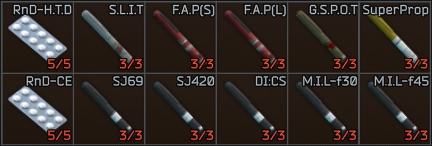

    

    

# S.L.U.Ts
**S.L.U.Ts company aims at producing high quality Special Life Uplifting Technologies** is a Developer, Producer and Distributor of some Special Medical Cocktails mainly for State Military and Private Military Companies under special license.
The company also provides some of its products to Hospitals and Medical Personnals

## Product preview

### S.L.U.Ts-SJ420 Injector
- HP Resource: 3
- Use Time: 2sec
- Contussion: Del. 5sec / Dur. 10sec (+100%)
- Skill "Attention": Del. 10sec / Dur. 1800sec (+75)
- Skill "Perception": Del. 10sec / Dur. 1800sec (+75)
- Hydration Recovery: Del. 50sec / Dur. 1800sec (-0.2)
- Contussion: Del. 1800sec / Dur. 10sec (+100%)
- Tunnel Effect: Chance 85% / Del. 1805sec / Dur. 25sec (+1)

**"SJ420 also known as NERD Stim. This stim inject about a 100 thousand nano robots into your blood. which then rush towards your brain and cling to it. sharing their db of items with it. making you super smart, and able to understand what you see just by the glimpse of it. unfortunately, this effect has limited time and die off as soon the bots loose their battery power. some individuals might experience minor side effects for a short period of time. this product contains drug elements which may be addictive to some individuals. S.L.U.Ts company aims at producing high quality Special Life Uplifting Technologies"**

### S.L.U.Ts-G.S.P.O.T Injector
- HP Resource: 3
- Use Time: 2sec
- Weight Limit: Del. 5sec / Dur. 840sec (+85%)
- Health Regeneration: Del. 210sec / Dur. 630sec (-0.3)
- Stamina Recovery: Dur. 840sec (+2)
- Energy Recovey: Del. 10sec / Dur. 230sec (+0.2)
- Energy Recovery: Chance 98% / Del. 240sec / Dur. 600sec (-0.3)
- Hands Tremor: Chance 92% / Del. 780sec / Dur. 60sec
- Contussion: Chance 15% / Del. 840sec / Dur. 30sec (+100%)

**"Graravity Strenght and Power Oriented Trigger stimulant is a product of experimentation with the legendary M.U.L.E stimulant with an addition of viagra ingredients. commonly used by the military workers to overcome the pain of lifting heavy equipment without an ExoSkeleton. Testimonials say "It's almost like weaing an ExoSkeleton, but much cheaper." some individuals might experience minor side effects for a short period of time. this product contains drug elements which may be addictive to some individuals. S.L.U.Ts company aims at producing high quality Special Life Uplifting Technologies"**

    

> [!NOTE]
> Tested on SPT: 3.5.5, 3.5.6, 3.5.7, 3.6.1, 3.7.1

> [!IMPORTANT]
> Should work on all SPT versions over 3.5.*

> [!WARNING]
> Might Work on previous versions but its not a guarantee. and I am not going to make it happen
> You can try editing the files to fit previous version, althou I would not know why you would want to ;)
